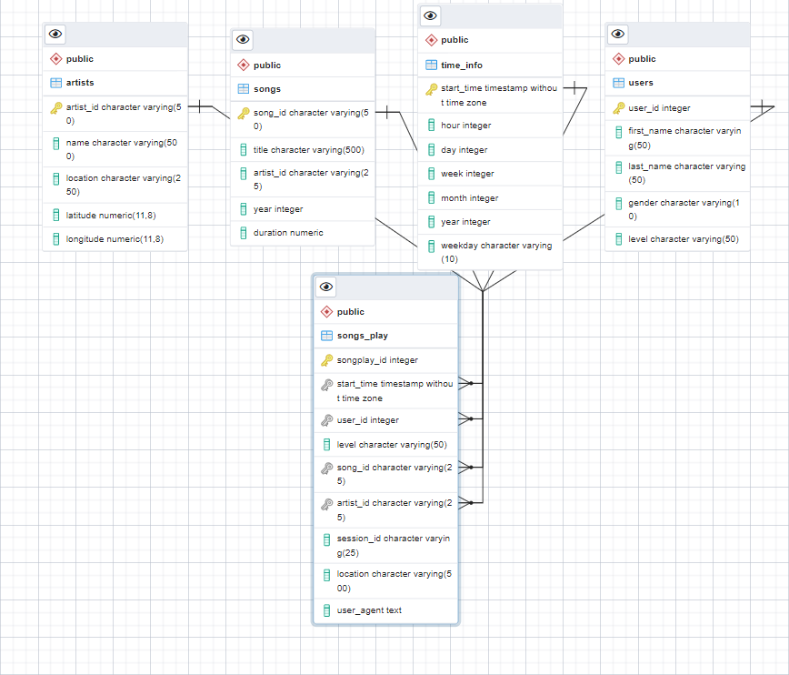

# Sparkify Data
## Overview
Sparkify, a music streaming startup, has grown their user base and song database and needs processes and data in the cloud. Their data has been moved to S3 from on prem, in a directory of JSON logs on user activity on the app, as well as a directory with JSON metadata on the songs in their app.
This project creates an ETL pipline that extracts their data from S3, stages them in Redshift, and transforms data into a set of dimensional tables for their analytics team to continue finding insights into what songs their users are listening to.

### Understanding the Data
The data is stored on S3 via the s3 link below
Song data: s3://udacity-dend/song_data
Log data: s3://udacity-dend/log_data
Log data json path: s3://udacity-dend/log_json_path.json

##### Song Dataset
The first dataset is a subset of real data from the Million Song Dataset. Each file is in JSON format and contains metadata about a song and the artist of that song. The files are partitioned by the first three letters of each song's track ID. For example, here are file paths to two files in this dataset.

song_data/A/B/C/TRABCEI128F424C983.json
song_data/A/A/B/TRAABJL12903CDCF1A.json

Below is an example of what a single song file, TRAABJL12903CDCF1A.json, looks like:

'''
{
    "num_songs": 1, 
    "artist_id": "ARJIE2Y1187B994AB7",
     "artist_latitude": null, 
     "artist_longitude": null,
      "artist_location": "",
      "artist_name": "Line Renaud", 
      "song_id": "SOUPIRU12A6D4FA1E1", 
      "title": "Der Kleine Dompfaff", 
      "duration": 152.92036, 
      "year": 0
}
'''

##### Log Dataset
The second dataset consists of log files in JSON format generated by this event simulator based on the songs in the dataset above. These simulate app activity logs from an imaginary music streaming app based on configuration settings.

The log files in the dataset are partitioned by year and month. For example, here are file paths to two files in this dataset.

log_data/2018/11/2018-11-12-events.json
log_data/2018/11/2018-11-13-events.json

The image below is an example of what the data in a log file, 2018-11-12-events.json, looks like.

### Entity relationship Diagram of the database created

The ERD of the database

## How to run the python script
### Install Dependencies
To run the scripts in the project first 
1. Create an AWS account.
2. create an AWS user that can be used to connect to AWS programmatically.
3. Store the SECRETCODE and KEY in a save place.
4. Create a role and attach AmazonS3ReadOnlyAccess policy to it.
5. Store the name of the role and input it in dwh2.cg

1. complete the dwh2.cfg file by replacing the text in **astericks**
[AWS]
KEY= **Key of the user with programtic access**
SECRET=**secret key of programatic access**

[CLUSTER]
CLUSTER_NODE_TYPE=dc2.large
CLUSTER_TYPE=multi-node
CLUSTER_IDENTIFIER=sparkifyCluster
CLUSTER_NUM_NODES=4
DB_NAME=**dbname**
DB_USER=**db_user**
DB_PASSWORD=**db_password**
DB_PORT=5439

2. Run the cells in the infrastructure_setup.ipynb until the mark down  ***Delete AWS Resources***
3. Take note of the DWH_ENDPOINT and DWH_ROLE_ARN
4. Go to dwh.cfg and complete the HOST and ARN with the DWH_ENDPOINT and DWH_ROLE_ARN respectively.
5. Fill in the DB_NAME, DB_USER, DB_PASSWORD with the same value as in dwh2.cfg

ETL
1. Run the create_tables.py to create the staging tables, fact table, and dimensional tables
2. Run etl.py file to perform the ETL
3. confirm on AWS Redshift that the data is now in redshift

